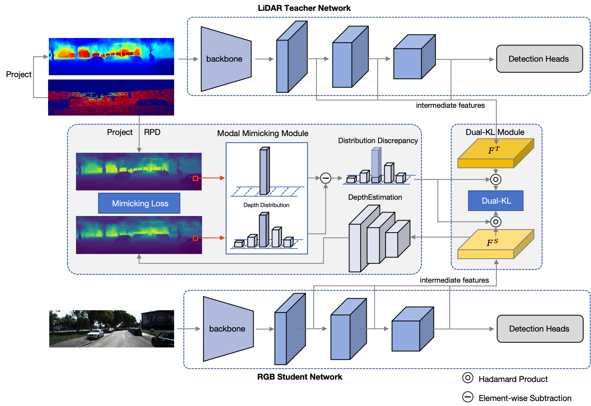

# [MonoMMKD](https://arxiv.org/abs/2310.11316)

<p align="center">  </p>

## **Introduction**

This is the PyTorch implementation of the paper **Modal Mimicking Knowledge Distillation for Monocular Three-Dimensional Object Detection**

## **Abstract**

Monocular three-dimensional (3D) object detection has gained attention for its cost-effectiveness in autonomous driving systems. Nevertheless, the extraction of depth information from two-dimensional (2D) images is an ill-posed problem. To address this challenge, cross-modal knowledge distillation techniques is widely adopted. A prevalent approach involves projecting Light Detection and Ranging (LiDAR) data onto the image plane to train teacher networks that share homogeneous architectures with student networks. Nevertheless, the alignment of features between LiDAR-based teacher networks and image-based student networks remains challenging. In order to address the inherent misalignment between modalities, this paper proposes a Modal Mimicking Knowledge Distillation (MMKD) framework using deep convolutional neural networks for autonomous perception tasks. The purpose of the MMKD framework is to explicitly reinforce depth features in the image-based student network, by introducing a depth prediction branch on the foundation of homogeneous teacher and student networks. Specifically, we propose a Road Plane Discretization (RPD) strategy that transforms projected LiDAR information to construct depth supervision signals better suited to the image plane. Concurrently, we propose Dual-Kullback-Leibler divergence distillation (DualKL), which integrates a dynamic Kullback-Leibler divergence balancing mechanism with depth uncertainty weighting, to efficaciously extract and transfer knowledge from the teacher network. The experimental results demonstrate that the proposed method achieves significant performance improvements on Karlsruhe Institute of Technology and Toyota Technological Institute (KITTI) benchmarks. Specifically, our approach achieves 4.4\% improvement on the easy level and 2.1\% improvement on the difficult level compared to the baseline model. Our code will be released at https://github.com/yangmenghao9/MonoMMKD.


## **Overview**

- [Installation](#installation)
- [Getting Started](#getting-started)
- [Results](#results-on-kitti-val-set)

## **Installation**

### Installation Steps

a. Clone this repository.

b. Install the dependent libraries as follows:

* Install the dependent python libraries: 
  
  ```shell
  pip install torch==1.12.0 torchvision==0.13.0 pyyaml scikit-image opencv-python numba tqdm torchsort
  ```

* We test this repository on Nvidia 3090 GPUs and Ubuntu 18.04. You can also follow the install instructions in [GUPNet](https://github.com/SuperMHP/GUPNet) (This respository is based on it) to perform experiments with lower PyTorch/GPU versions.

## **Getting Started**

### Dataset Preparation

* Please download the official [KITTI 3D object detection](http://www.cvlibs.net/datasets/kitti/eval_object.php?obj_benchmark=3d) dataset and organize the downloaded files as follows:

```
this repo
├── data
│   │── KITTI3D
|   │   │── training
|   │   │   ├──calib & label_2 & image_2 & depth_dense
|   │   │── testing
|   │   │   ├──calib & image_2
├── config
├── ...
```

* You can also choose to link your KITTI dataset path by
  
  ```
  KITTI_DATA_PATH=~/data/kitti_object
  ln -s $KITTI_DATA_PATH ./data/KITTI3D
  ```

### Training & Testing

#### Test and evaluate the pretrained models

```shell
CUDA_VISIBLE_DEVICES=0 python tools/train_val.py --config configs/monommkd.yaml -e   
```

#### Train a model

```shell
CUDA_VISIBLE_DEVICES=0 python tools/train_val.py --config configs/monommkd.yaml
```

## **Results on Kitti Val Set**

<table align="center">
    <tr>
        <td rowspan="2" div align="center">Models</td>
        <td colspan="3" div align="center">Car@3D IoU=0.7</td>  
        <td colspan="3" div align="center">Car@BEV IoU=0.7</td>
        <td rowspan="2" div align="center">Weights</td>
    </tr>
    <tr>
        <td div align="center">Easy</td> 
        <td div align="center">Mod</td> 
        <td div align="center">Hard</td> 
        <td div align="center">Easy</td> 
        <td div align="center">Mod</td> 
        <td div align="center">Hard</td>  
    </tr>
    <tr>
        <td div align="center">teacher</td>
        <td div align="center">63.19</td> 
        <td div align="center">43.40</td> 
        <td div align="center">36.62</td> 
        <td div align="center">74.46</td> 
        <td div align="center">53.74</td> 
        <td div align="center">46.41</td> 
        <td div align="center"><a href="https://pan.baidu.com/s/1p_DtDrZ0dOKdKk2gkWOvkA?pwd=r2br">link</a></td>
    </tr>    
    <tr>
        <td div align="center">student</td>
        <td div align="center">25.72</td> 
        <td div align="center">17.77</td> 
        <td div align="center">14.74</td> 
        <td div align="center">33.37</td> 
        <td div align="center">23.65</td> 
        <td div align="center">20.84</td> 
        <td div align="center"><a href="https://pan.baidu.com/s/1vlmbp1tE0CCp92vtAXe8pQ?pwd=hf7w">link</a></td>
    </tr>
    <tr>
        <td div align="center">MonoMMKD</td>
        <td div align="center">30.15</td> 
        <td div align="center">20.30</td> 
        <td div align="center">16.84</td> 
        <td div align="center">38.81</td> 
        <td div align="center">26.72</td> 
        <td div align="center">22.57</td> 
        <td div align="center"><a href="https://pan.baidu.com/s/1MaiJM4WEmdfEvI1UR1U-XQ?pwd=e2pc">link</a></td>
    </tr>
</table>


## **Acknowledgements**

We thank these great works and open-source codebases: [MonoSDK](https://github.com/Senwang98/MonoSKD), [MonoDistill](https://github.com/monster-ghost/MonoDistill), [DID-M3D](https://github.com/SPengLiang/DID-M3D), [MonoDLE](https://github.com/xinzhuma/monodle)
